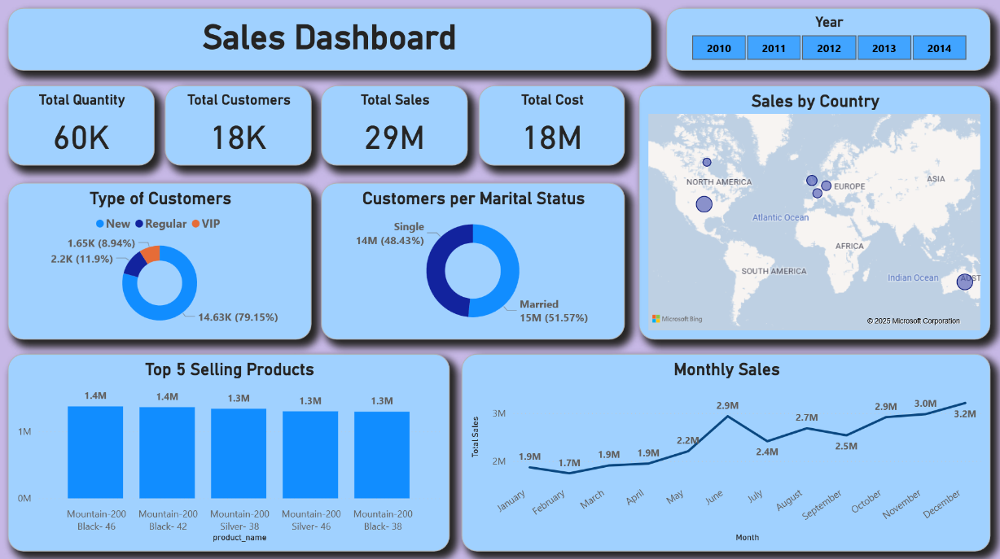

# 🗃️ Sales Insights: Customers & Products Analysis

## 📖 Overview

This project focuses on:

1. **Data Architecture**: Building a scalable and organized data warehouse using the **Medallion Architecture**.

2. **ETL Pipelines**:  Extracting, transforming, and loading data from source systems into the warehouse.

3. **Data Modeling**: Building fact and dimension tables structured optimized for analytical queries.

4. **Analytics & Reporting**: Creating SQL-based reports and dashboards to deliver actionable insights. 

## 🧱 Data Architecture
The data architecture is designed around the Medallion Architecture framework, organized into Bronze, Silver, and Gold layers.

1. **Bronze Layer**: Stores raw, unprocessed data directly ingested from source systems. Data is loaded from CSV files into a SQL Server database. [more details](scripts/bronze/BRONZE.md)

2. **Silver Layer**: Applies data cleaning, standardization, and normalization to ensure data quality and consistency, making it suitable for analysis. [more details](scripts/silver/SILVER.md)

3. **Gold Layer**: Stores curated, business-ready datasets organized into star schema models, optimized for reporting and analytical queries. [more details](scripts/gold/GOLD.md)

## 📂 Datasets
🔹CRM: Customer Relationship Management
- **cust_info.csv**: customer informations
- **prd_info.csv**: product informations
- **sales_details.csv**: transactional Records about Sales & Orders

🔹ERP: Enterprise Resource Planning
- **CUST_AZ12.csv**: extra customer informations → birth date 
- **LOC_A101.csv**: extra customer informations → country
- **PX_CAT_G1V2.csv**: extra procuct informations → category, subcategory, maintenance

## 📊 Analytics & Reporting

### Analysis using SQL ([click here to view code](scripts/_data_analysis))
The **Gold Layer** served as the foundation for analysis, enabling: ([gold layer info](docs/Gold_Info.md))
1. Exploration of customer behavior  
2. Evaluation of product performance  
3. Identification of sales trends over time  
4.  Segmentation and market share insights  
5.  Development of business-oriented reports  
    

### Data Visualization using Power BI dashboard

